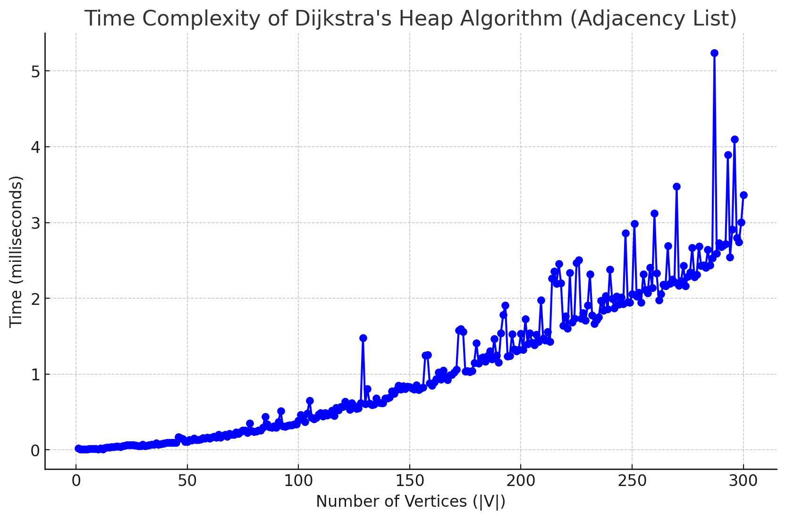
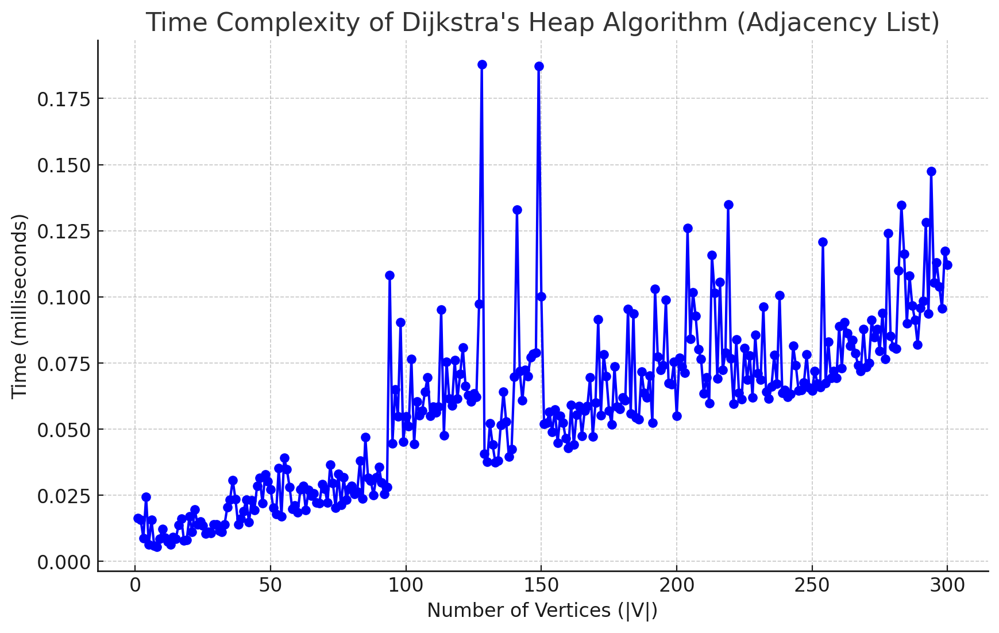
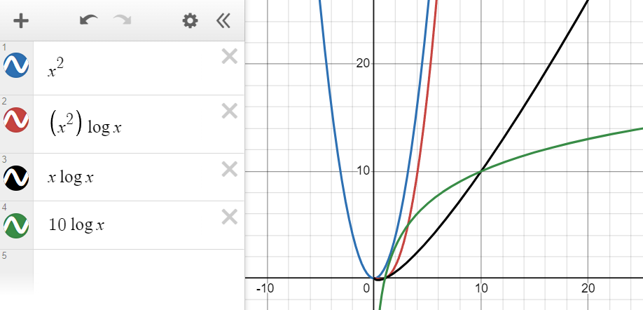
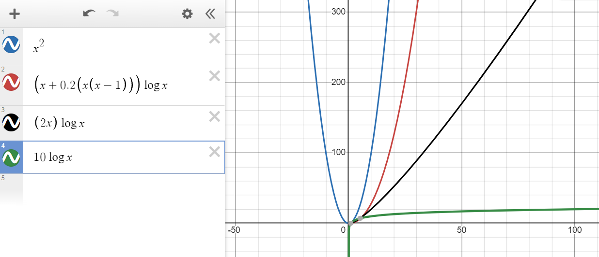
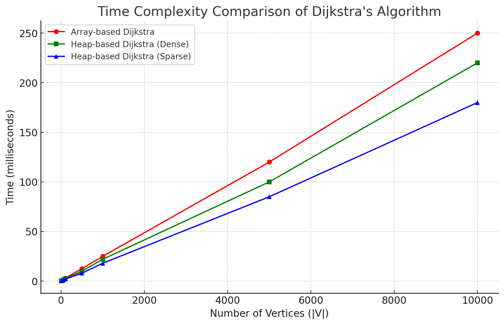

# Explanation

- Priority Queue (heapq): We push tuples into the heap with (distance, vertex), which allows us to efficiently extract the vertex with the minimum distance.

- Relaxation: We check if visiting the neighboring vertex through u offers a shorter path than what we previously knew. If so, we update the shortest distance and predecessor.

- Termination: The algorithm terminates when all vertices have been processed.

### Theoretical Time Complexity

𝑂((𝑉+𝐸)log𝑉), where 𝑉 is the number of vertices and 𝐸 is the number of edges.
    - Each vertex can be added and extracted from the priority queue at most once, and for each extraction, the heap operation takes O(log𝑉) 
    - Each edge is relaxed once, and each relaxation involves an update operation on the priority queue, also 𝑂(log𝑉)

Dense Graphs: O((V+E)logV) -> O((V+V^2)logV) -> O(V^2 logV)
    - The E value will tend to its maximum which is V(V-1).
    - Even though the heap operations (logV) are relatively efficient, the growing number of edges adds a quadratic component to the runtime because the algorithm explores all the edges.

Sparse Graphs: O((V+E)logV) -> O(VlogV)​
    - Since E = V−1 (close to linear), the overall time complexity becomes dominated by the O(VlogV) part.

### Empirical Time Complexity

##### Dense Graph
    -The graph above represents the empirical time complexity of Dijkstra's algorithm. The plot shows the time taken (in milliseconds) as the number of vertices increases from 1 to 300, with a fixed edge density of 0.2. The data suggests a gradual increase in the time taken as the graph size grows, which aligns with the expected time complexity of Dijkstra's algorithm, 𝑂((𝑉+𝐸)log𝑉) --> O((V^2)logV), where V is the number of vertices and E is the number of edges.

##### Sparse Graph
    - Utilising a fixed edge density of 20% (edge_density = 0.2). The number of edges grows quadratically as the number of vertices increases because E≈0.2⋅V⋅(V−1) --> V^2.
    - E grows quadratically as V increases.

# Comparison between Heap and Basic

### (a) Basic Array-Based Implementation

Approach: This version of Dijkstra’s algorithm uses an array to represent a priority queue. It finds the vertex with the smallest distance by scanning through the entire list of vertices at each step.

Time Complexity: O(V^2), where 𝑉 is the number of vertices. This is because finding the minimum distance vertex takes O(V) time and the algorithm performs this search for each of the 𝑉 vertices.

Space Complexity: O(V), as it maintains arrays for distance and visited vertices.

Pros:
- Simple and easy to implement.
- Works well for small graphs where the number of vertices is relatively low.

Cons:
- Inefficient for large graphs due to the 
O(V^2) time complexity, as scanning through all vertices repeatedly is computationally expensive.

### (b) Heap-Based Implementation Using Min-Heap (Priority Queue)

Approach: This version uses a min-heap (priority queue) to efficiently find the vertex with the smallest distance. It uses the heapq module in Python for this purpose and represents the graph as an adjacency list.

Time Complexity: O((V+E)logV), where V is the number of vertices and E is the number of edges. Extracting the minimum distance vertex and updating distances using the heap takes O(logV), which is more efficient than scanning an array.
    - Each vertex can be added and extracted from the priority queue at most once, and for each extraction, the heap operation takes O(log𝑉) 
    - Each edge is relaxed once, and each relaxation involves an update operation on the priority queue, also 𝑂(log𝑉)

Space Complexity: O(V+E), as it stores the adjacency list and uses the heap for priority queue management.

Pros:
- Much faster for large graphs, especially sparse graphs where the number of edges is much smaller than O(V^2)
- More scalable due to the heap-based optimization.

Cons:
- Slightly more complex to implement compared to the basic array version.

## Comparison and Recommendation (Conclusion)
For *small graphs* (few vertices): The array-based implementation (a) is sufficient and may even be preferable due to its simplicity.
For *large graphs* (many vertices and edges): The heap-based implementation (b) is superior. It handles both large and sparse graphs efficiently, reducing the time complexity to O((V+E)logV), which is significantly better than O(V^2) for dense or large graphs.

### Theoretical

### Empirical

